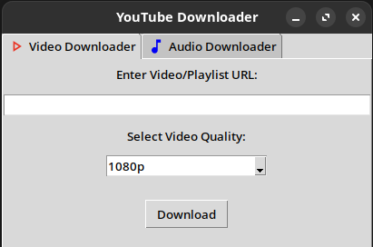
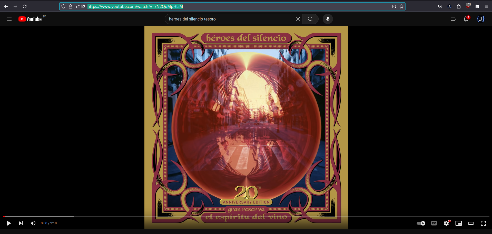
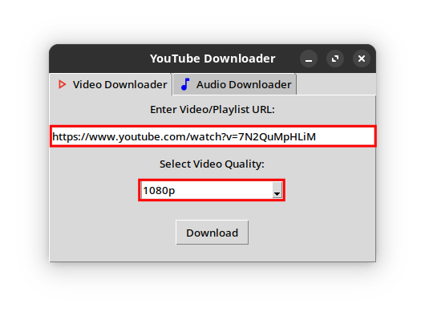
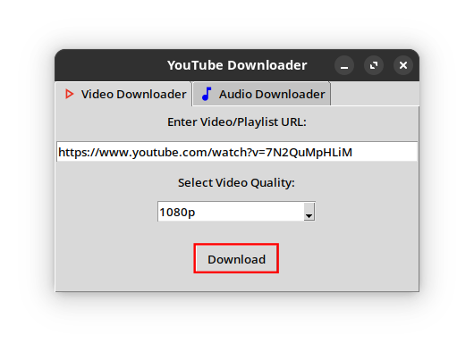
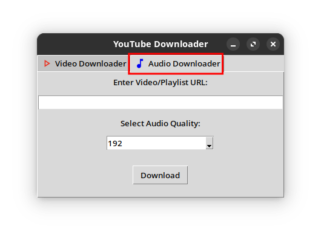
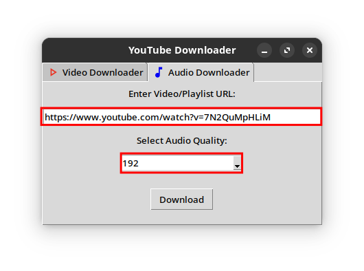
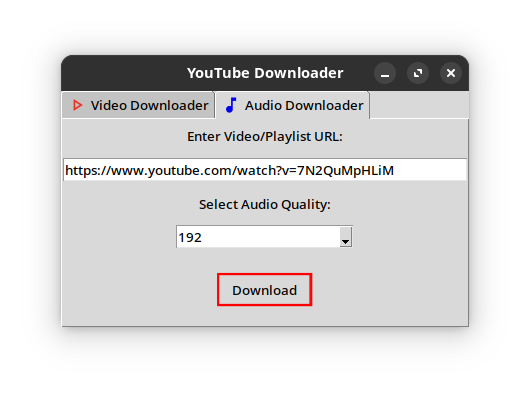

# YouTube Downloader App 📹

This is a basic app made with Python, that let you download videos and audios from YouTube.

## How to use it? 🤔

Turn the virtual environment on:

* Linux and Mac: source ytdownloader/bin/activate

* Windows: ytdownloader\Scripts\activate

The app has two tabs:

1. **Video Downloader** 📼

2. **Audio Downloader** 🕪

Dependig of what kind of file do you want to download (Video or Audio) you have to choose between both tabs.

### Downloading Video Format 📼

1. Choose the **Video Downloader** tab.

2. Then search on YouTube the video that you'd like to download and copy its link.

3. Paste the link in the input bar and select the resolution that you'd like for the video.

4. Then press the **Download** button.

5. When the download finished this will be inside a new folder called **video** inside the folder of the app.

### Downloading Audio Format 🕪

1. Choose the **Audio Downloader** tab.

2. Then search on YouTube the video that you'd like to download and copy its link.

3. Paste the link in the input bar and Select the quality that you'd like for the audio.

4. Then press the **Download** button.

5. When the download finished this will be inside a new folder called **download** inside the folder of the app.

> **Note:** You can also download entire YouTube playlists in both formats.

## FREE USAGE 🆓

I made this basic program with educational purpouses.
Feel free to clone this repository, modify the code, and make changes 😁.
